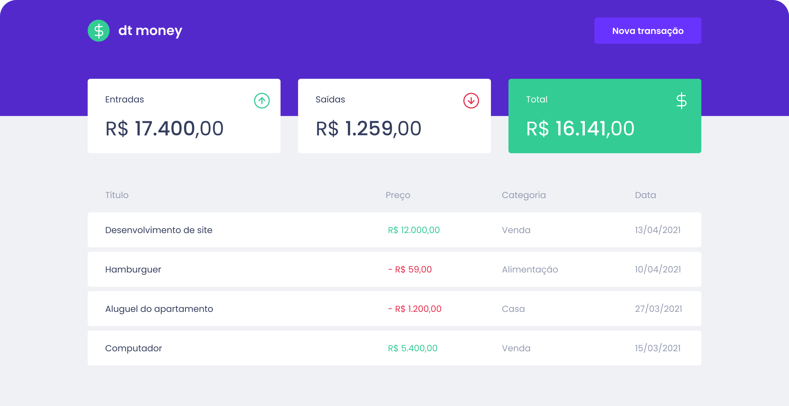

# 

Esta aplicação foi desenvolvida através do treinamento Ignite da Rocketseat,
foi utilizado styled-components para estilização e miragejs para simular um banco de dados, além do Context API para o gerenciamento global de estados da aplicação.

## Iniciando a aplicação

### `npm start or yarn start`

Para iniciar a aplicação na porta 3000, localhost:3000

